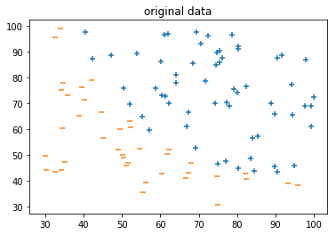
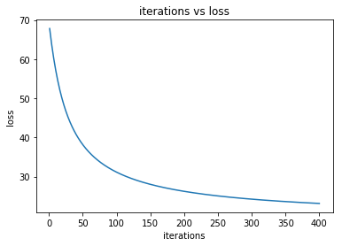

```python
#!/usr/bin/env python3
# -*- coding: utf-8 -*-
"""
Created on Sat Feb 17 20:54:59 2018

@author: JSen
"""

import numpy as np
import matplotlib.pyplot as plt
from numpy import loadtxt
import os
from scipy.optimize import minimize

os.chdir(os.path.realpath('.'))

data = loadtxt('ex2data1.txt', delimiter=',')

X = data[:, :-1]
#最后一列为label
y = data[:, -1:]

print(X.shape, y.shape)


def plot_data(X,y,title=''):
    pos = np.where(y==1)[0]
    neg= np.where(y==0)[0]
    plt.scatter(X[pos, 0], X[pos, 1], marker='+')

    plt.scatter(X[neg, 0], X[neg, 1], marker='_')
    plt.title(title)
    plt.show()

plot_data(X, y,"original data")


def feature_normalization(X):
    X_norm = X

    column_mean = np.mean(X_norm, axis=0)
#     print('mean=', column_mean)
    column_std = np.std(X_norm, axis=0)
#     print('std=',column_std)

    X_norm = X_norm - column_mean
    X_norm = X_norm / column_std

    return column_mean, column_std, X_norm

means, stds, X_norm = feature_normalization(X)
plot_data(X_norm, y, "normalized data")


X = X_norm
X = np.hstack((np.ones((len(y), 1)), X))

initial_theta = np.zeros((X.shape[1],1))#初始化theta

def sigmoid(z):
    s = 1.0/(1.0 + np.exp(-z))
    return s

def computeCost(theta: np.ndarray, X: np.ndarray, y: np.ndarray ):
    m= len(y)
    h =sigmoid(np.dot(X, theta))
#    print('H', h)
    J =( np.dot(np.transpose(-y), np.log(h)) - np.dot(np.transpose(1-y), np.log(1-h)) )/m

#    print("cost:", J)
    return J

def gradient(theta: np.ndarray, X: np.ndarray, y: np.ndarray ):
    m= len(y)
#    np.reshape(theta, (X.shape[1], 1))
    h =sigmoid(np.dot(X, theta))
    grad = np.dot(np.transpose(X), (h-y)) / m

    return grad

def gradient_1(theta, X, y):
    '''求一阶导数'''
    z = np.dot(X, theta)
    p1 =sigmoid(z)

    g = -np.dot(X.T, (y - p1))
    return g

def gradient_2(theta, X, y):
    '''为了用牛顿迭代法，如何求二阶倒数呢？按照公式得出的矩阵阶数不对'''
    pass

grad2=gradient_2(initial_theta, X, y)

def target_func_maxmium_likelihood(theta, X, y):
    '''minimize the formula
        X 包含偏置项
    '''
    l = np.sum( -y * np.dot(X, theta) + np.log(1 + np.exp(np.dot(X, theta))))
    return l
target_func_maxmium_likelihood(initial_theta, X, y)


test_theta = np.array([[-24],[0.2],[0.2]])
# grad1 = gradient_1(initial_theta,X, y )
# print(target_func_maxmium_likelihood(grad2, X, y))
# cost = computeCost(test_theta,X, y )


# print( computeCost(initial_theta,X, y ))
# print(gradient(initial_theta,X, y ))
#optimize.fmin_cg(computeCost, initial_theta,fprime=gradient, args=(X, y, initial_theta), maxiter=500)
#result = optimize.fmin_bfgs(computeCost, initial_theta, args=(X, y, initial_theta), maxiter=500)
#传参数不对，故放弃。使用梯度下降法
#res = minimize(computeCost, initial_theta, method='BFGS',jac=gradient,args=(initial_theta,X, y),options={'disp': True})


alpha = 0.001;
iterations = 400;

def gradientDescent(X, y, theta, alpha, iterations):
     m = len(y)
     J_history = np.zeros((iterations, 1))

     for i in range(iterations):
        grad = gradient_1(theta, X, y)
        theta = theta - alpha * grad
        J_history[i] = target_func_maxmium_likelihood(theta,X, y)
#         print(J_history[i])

     return theta, J_history

theta, J_history= gradientDescent(X, y, initial_theta, alpha, iterations)


def plotJ(J_history, iterations):
    x = np.arange(1, iterations+1)
    plt.plot(x, J_history)
    plt.xlabel('iterations')
    plt.ylabel('loss')
    plt.title('iterations vs loss')
    plt.show()

plotJ(J_history, iterations)


```

    (100, 2) (100, 1)







